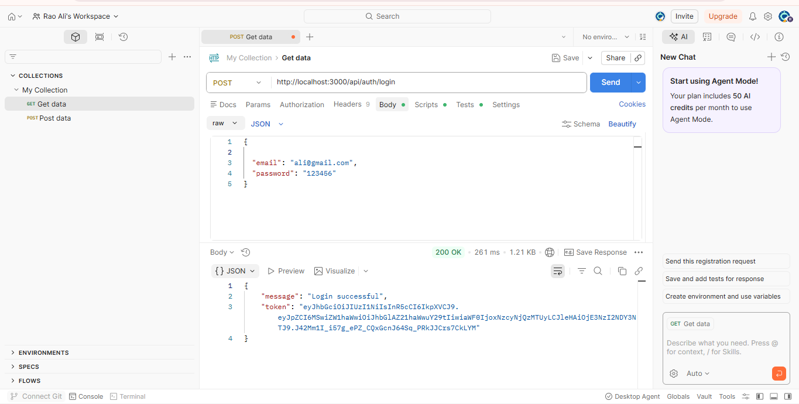
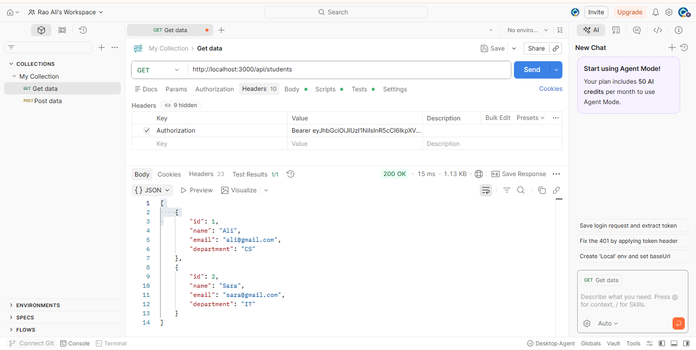
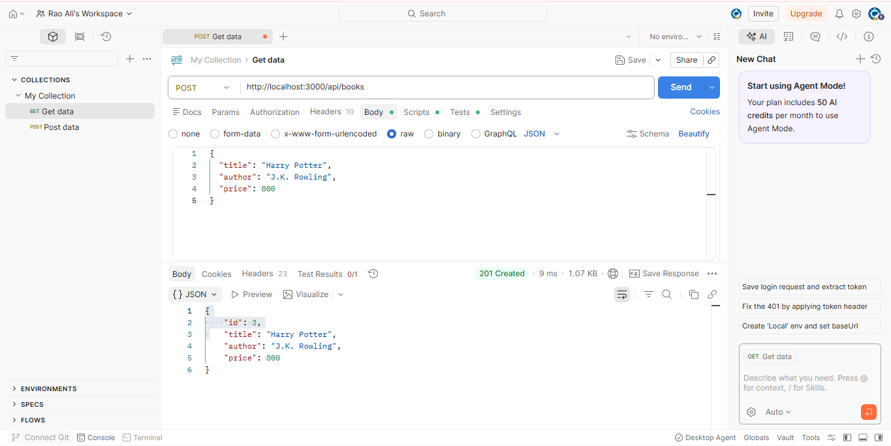
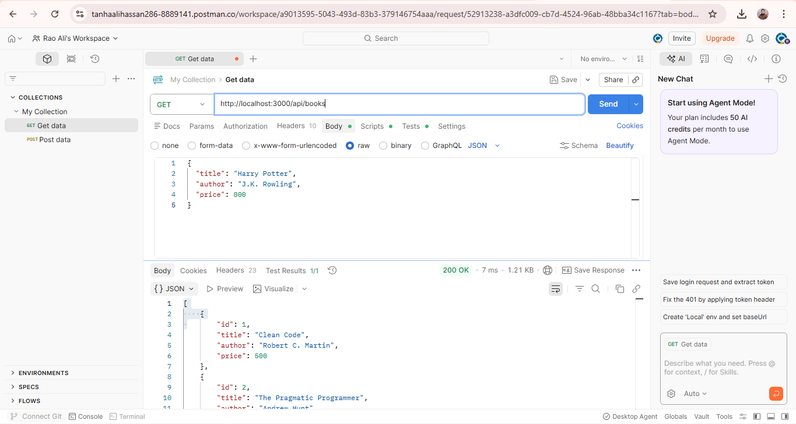
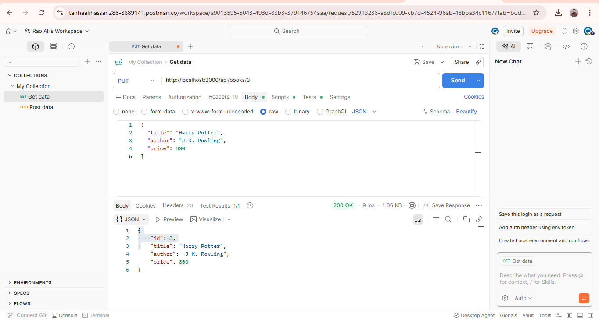
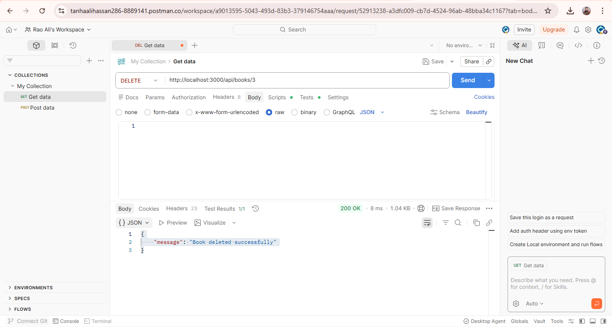
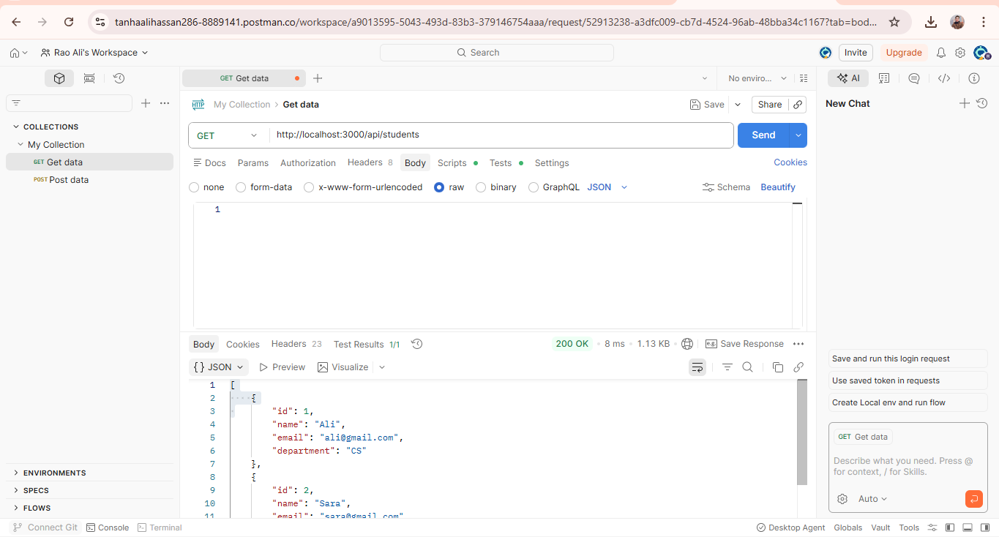

# REST API — Student & Book Management System


> A fully functional REST API built with **Node.js** and **Express.js** — covering CRUD operations, JWT Authentication, CORS, Rate Limiting, and Security best practices.

---

## Table of Contents

- [About the Project](#about-the-project)
- [Topics Covered](#topics-covered)
- [Project Structure](#project-structure)
- [Technologies Used](#technologies-used)
- [Getting Started](#getting-started)
- [API Endpoints](#api-endpoints)
- [Security Features](#security-features)
- [Testing with Postman](#testing-with-postman)
- [Screenshots](#screenshots)
- [HTTP Status Codes](#http-status-codes)
- [Author](#author)

---

## About the Project

This project is a complete **REST API** implementation for managing **Books** and **Students**, developed as part of the Web Technologies course. It demonstrates real-world REST API concepts including designing and implementing RESTful endpoints, full CRUD operations, JWT-based Authentication and Authorization, API Security (CORS, Rate Limiting, Helmet), and testing APIs using Postman.

---

## Topics Covered

### What is REST API?

REST stands for **Representational State Transfer**. It is an architectural style for designing networked applications that uses:

- **HTTP Protocol** for communication between client and server
- **Stateless** requests — each request contains all necessary information
- **Resource-based** URLs — nouns, not verbs (e.g. `/books` not `/getBooks`)
- **Standard HTTP Methods** — GET, POST, PUT, DELETE

---

### REST Principles Applied

| Principle | How It Is Applied |
|---|---|
| **Stateless** | Each request uses JWT token — server stores no session |
| **Client-Server** | Frontend (Postman) and Backend (Express) are completely separate |
| **Uniform Interface** | Standard endpoints like `/api/books` and `/api/students` |
| **Layered System** | Auth middleware layer sits between request and route handler |

---

### HTTP Methods

| Method | Purpose | Example in This Project |
|---|---|---|
| `GET` | Retrieve data | Get all books or students |
| `POST` | Create new data | Register user or add a book |
| `PUT` | Update existing data | Update book or student details |
| `DELETE` | Delete data | Remove a book or student |

---

### REST Best Practices Followed

- Used **nouns not verbs** — `/books` instead of `/getBooks`
- Used **plural resource names** — `/books`, `/students`
- Used **proper HTTP status codes** — 200, 201, 404, 401, 403
- All responses are in **JSON format**

---

### Authentication vs Authorization

**Authentication (AuthN)** — Verifying *who you are*

> Example: Logging in with your email and password

**Authorization (AuthZ)** — Verifying *what you are allowed to access*

> Example: Only logged-in users can add or delete books

In this project, after a successful login, the server returns a **JWT token**. That token must be sent in the `Authorization` header for all protected routes.

---

## Project Structure

```
rest-api-project/
│
├── server.js               ← Main entry point, server setup and middleware
├── .env                    ← Environment variables (PORT, JWT_SECRET)
├── package.json            ← Project dependencies
│
├── routes/
│   ├── auth.js             ← Register and Login endpoints
│   ├── books.js            ← Books CRUD endpoints
│   └── students.js         ← Students CRUD endpoints
│
└── middleware/
    └── auth.js             ← JWT token verification middleware
```

---

## Technologies Used

| Package | Purpose |
|---|---|
| **Express.js** | Web server and routing framework |
| **jsonwebtoken** | Generate and verify JWT tokens |
| **bcryptjs** | Hash passwords securely |
| **cors** | Handle Cross-Origin Resource Sharing |
| **helmet** | Set secure HTTP response headers |
| **express-rate-limit** | Limit requests to prevent DDoS attacks |
| **dotenv** | Load environment variables from `.env` file |

---

## Getting Started

### Prerequisites

Make sure you have the following installed:

- [Node.js](https://nodejs.org/) v18 or higher
- [Postman](https://www.postman.com/) for testing

### Installation Steps

**Step 1 — Clone the repository**

```bash
git clone https://github.com/YOUR_USERNAME/rest-api-project.git
cd rest-api-project
```

**Step 2 — Install all dependencies**

```bash
npm install express jsonwebtoken bcryptjs cors express-rate-limit helmet dotenv
```

**Step 3 — Create the `.env` file**

```
PORT=3000
JWT_SECRET=mysupersecretkey123
```

**Step 4 — Start the server**

```bash
node server.js
```

**Step 5 — Server is live**

```
✅ Server running on http://localhost:3000
```

---

## API Endpoints

### Auth Routes — No Token Required

| Method | Endpoint | Description |
|---|---|---|
| `POST` | `/api/auth/register` | Register a new user |
| `POST` | `/api/auth/login` | Login and receive a JWT token |

**Register Request Body:**

```json
{
  "name": "Ali",
  "email": "ali@gmail.com",
  "password": "123456"
}
```

**Login Response:**

```json
{
  "message": "Login successful",
  "token": "eyJhbGciOiJIUzI1NiIsInR5cCI6..."
}
```

---

### Books Routes

| Method | Endpoint | Token Required | Description |
|---|---|---|---|
| `GET` | `/api/books` | No | Get all books |
| `GET` | `/api/books/:id` | No | Get a single book by ID |
| `POST` | `/api/books` | Yes | Add a new book |
| `PUT` | `/api/books/:id` | Yes | Update an existing book |
| `DELETE` | `/api/books/:id` | Yes | Delete a book |

**POST Request Body:**

```json
{
  "title": "Harry Potter",
  "author": "J.K. Rowling",
  "price": 800
}
```

**Response (201 Created):**

```json
{
  "id": 3,
  "title": "Harry Potter",
  "author": "J.K. Rowling",
  "price": 800
}
```

---

### Students Routes — All Protected

| Method | Endpoint | Token Required | Description |
|---|---|---|---|
| `GET` | `/api/students` | Yes | Get all students |
| `GET` | `/api/students/:id` | Yes | Get a student by ID |
| `POST` | `/api/students` | Yes | Add a new student |
| `PUT` | `/api/students/:id` | Yes | Update a student |
| `DELETE` | `/api/students/:id` | Yes | Delete a student |

**GET Response (200 OK):**

```json
[
  { "id": 1, "name": "Ali", "email": "ali@gmail.com", "department": "CS" },
  { "id": 2, "name": "Sara", "email": "sara@gmail.com", "department": "IT" }
]
```

---

## Security Features

### CORS — Cross-Origin Resource Sharing

CORS is a browser security mechanism that controls which domains are allowed to make requests to the API. Without proper CORS setup, unauthorized websites cannot call your API.

```javascript
app.use(cors({
  origin: 'http://localhost:3000',
  methods: ['GET', 'POST', 'PUT', 'DELETE']
}));
```

---

### Helmet — HTTP Security Headers

Helmet automatically sets secure HTTP response headers that protect against common web attacks like XSS (Cross-Site Scripting) and clickjacking.

```javascript
app.use(helmet());
```

---

### Rate Limiting — DDoS Protection

Limits each IP address to a maximum of **100 requests per 15 minutes**. This prevents bots and attackers from flooding the server.

```javascript
const limiter = rateLimit({
  windowMs: 15 * 60 * 1000,
  max: 100,
  message: 'Too many requests, please try again later.'
});
```

---

### JWT Authentication Flow

```
1.  User sends email and password to /api/auth/login
2.  Server verifies credentials against stored data
3.  Server generates a JWT token (expires in 1 hour)
4.  Client receives and stores the token
5.  Client sends token in every protected request header
        Authorization: Bearer <token>
6.  Server middleware verifies the token
7.  Access is granted (200) or denied (401/403)
```

---

### Password Hashing — bcryptjs

Passwords are **never stored in plain text**. Before saving, every password is hashed using bcrypt with a salt round of 10.

```javascript
const hashedPassword = await bcrypt.hash(password, 10);
```

---

## Testing with Postman

### Step 1 — Register

- Method: `POST`
- URL: `http://localhost:3000/api/auth/register`
- Go to **Body** → select **raw** → select **JSON**
- Paste the register JSON body and click **Send**
- Expected: `201 Created`

### Step 2 — Login and Copy Token

- Method: `POST`
- URL: `http://localhost:3000/api/auth/login`
- Paste the login JSON body and click **Send**
- Expected: `200 OK` with a `token` in the response
- **Copy the full token value**

### Step 3 — Add Token to Protected Requests

For all routes that require a token, go to the **Headers** tab in Postman and add:

| Key | Value |
|---|---|
| `Authorization` | `Bearer YOUR_COPIED_TOKEN` |

### Step 4 — Test All Endpoints in Order

`Register` → `Login` → `GET books` → `POST book` → `GET all books` → `PUT book` → `DELETE book` → `GET students`

---

## Screenshots

### User Registration — 201 Created


### User Login — JWT Token Received — 200 OK


### GET All Students with JWT Auth — 200 OK


### POST Add New Book — 201 Created


### GET All Books — 200 OK


### PUT Update Book — 200 OK


### DELETE Book — 200 OK


### GET Students Final — 200 OK


> To display screenshots on GitHub: create a `screenshots/` folder in the project root and save your Postman images with the exact filenames shown above.

---

## HTTP Status Codes

| Code | Meaning | When It Appears |
|---|---|---|
| `200 OK` | Request successful | GET, PUT, DELETE success |
| `201 Created` | New resource created | POST success |
| `400 Bad Request` | Invalid or missing input | Validation failure |
| `401 Unauthorized` | No token provided | Missing Authorization header |
| `403 Forbidden` | Invalid or expired token | Wrong JWT |
| `404 Not Found` | Resource does not exist | ID not found |
| `429 Too Many Requests` | Rate limit exceeded | DDoS protection triggered |
| `500 Internal Server Error` | Unexpected server failure | Bug or crash |

---

## Assignment Coverage

| Lecture PDF | Topics | Status |
|---|---|---|
| Designing REST API | REST principles, endpoint design, HTTP methods, best practices | ✅ Done |
| Implementing REST API | CRUD operations, Node.js + Express, Postman testing | ✅ Done |
| REST API Security | CORS, Helmet, Rate Limiting, JWT, bcrypt, session handling | ✅ Done |

---

## Author

**Name:** Ali Hassan

**Roll No:** DA23-BSE-024

**Section:** SE-A

**Course:** Advance Web 

---

## References

- REST architectural style — Roy Fielding doctoral dissertation (2000)
- HTTP Protocol — RFC 2616
- JSON Web Token — RFC 7519
- OAuth 2.0 — IETF Standard
- Express.js Docs — https://expressjs.com
- Node.js Docs — https://nodejs.org
